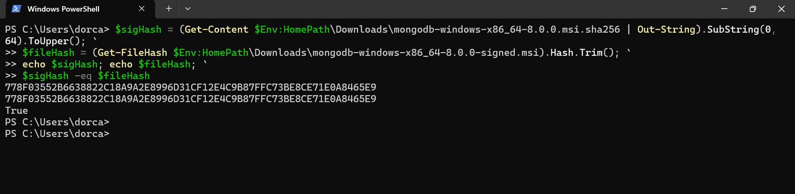
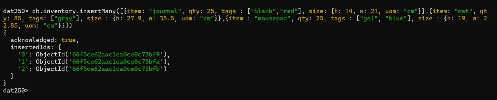
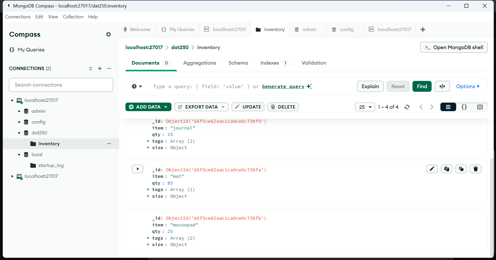
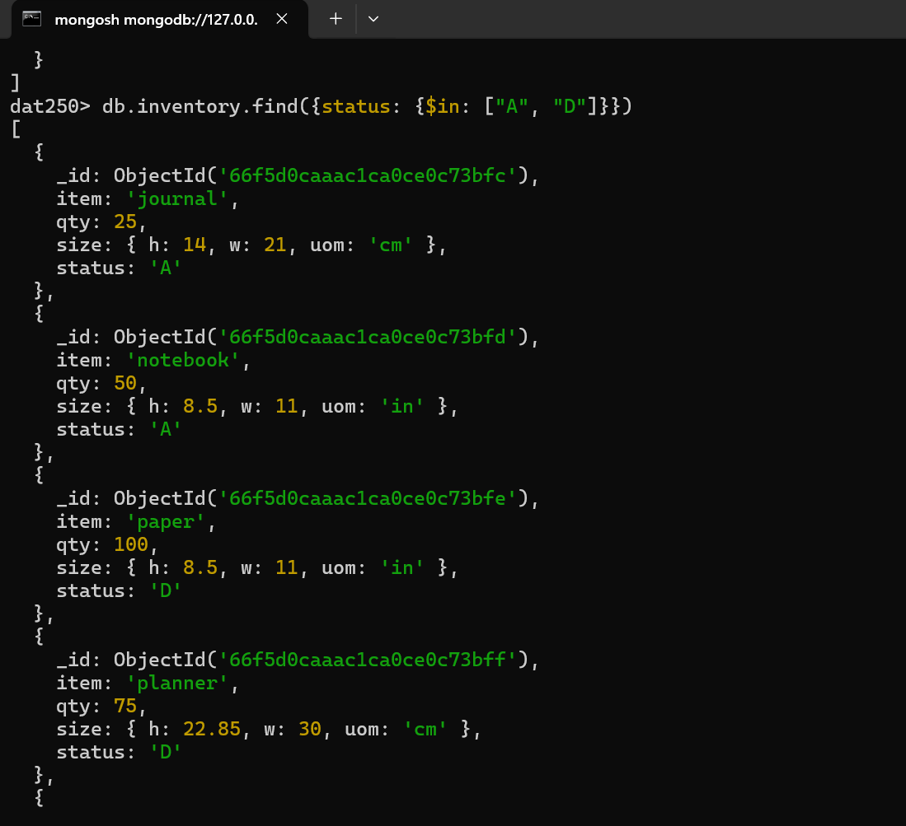
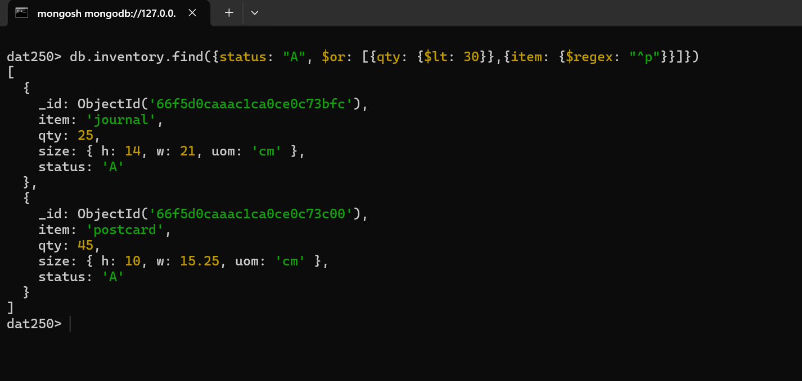
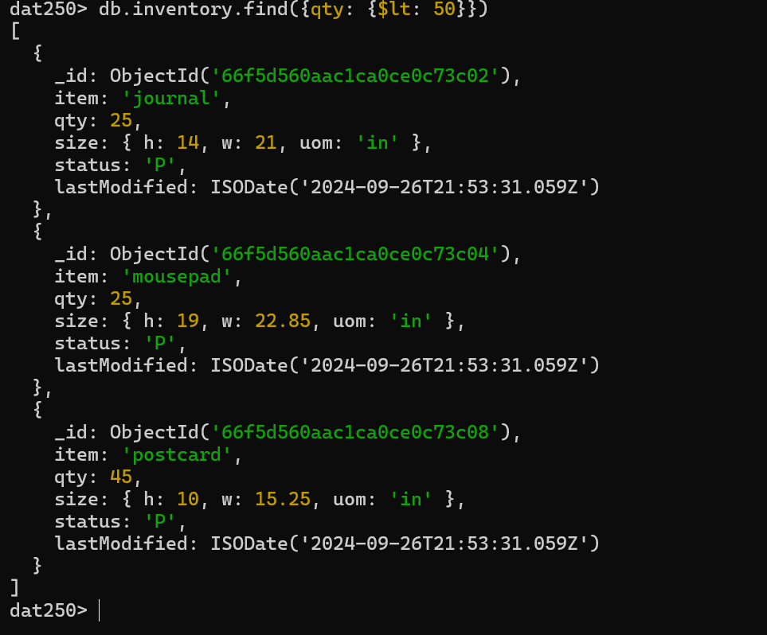
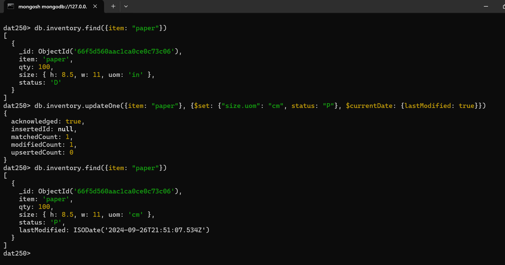
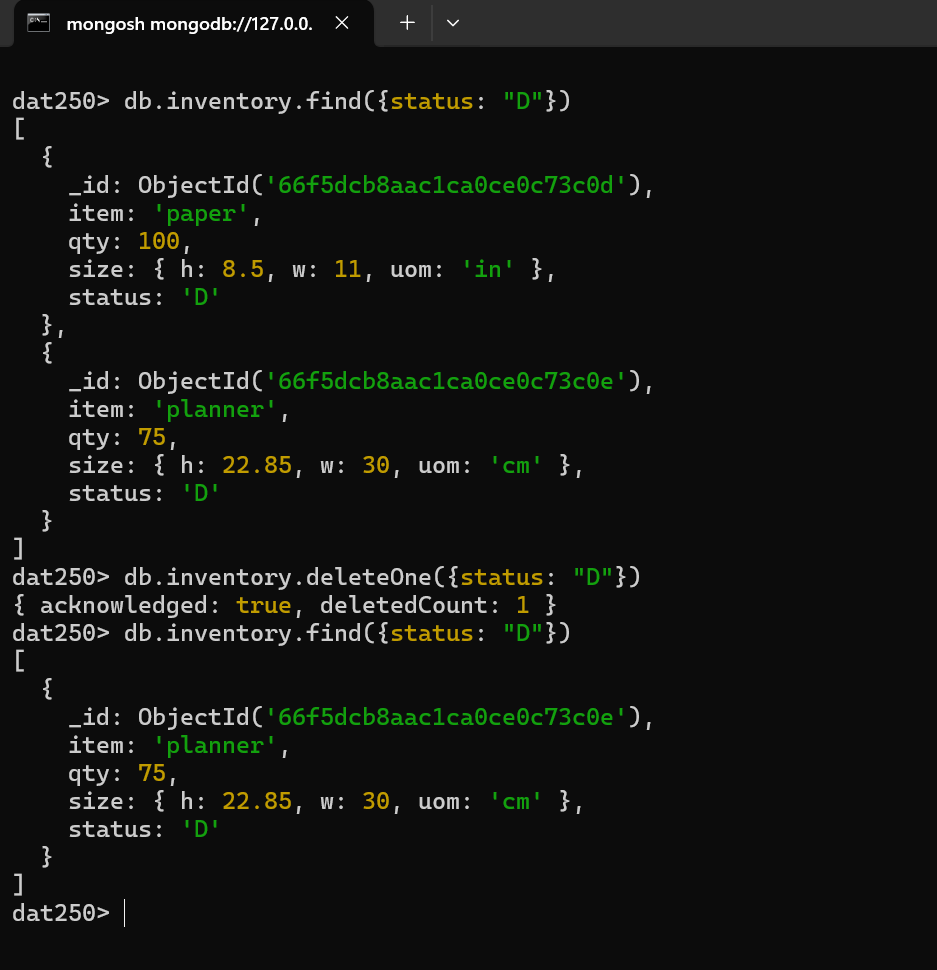
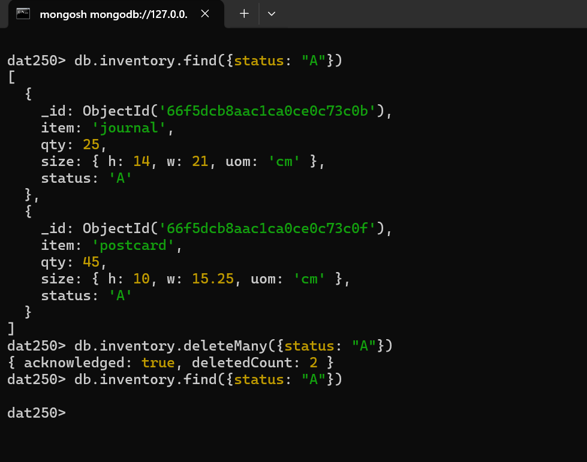

## Expass 5 Report

The goal for this week was to learn more about NoSQL databases, specifically MongoDB. We were supposed to follow some MongoDB tutorials to know how to do the CRUD operations and also had to learn more about aggregation.
##### Installation
The installation went quickly. I decided to install both the MongoDB Compass with Windows as a service, and also decided to install the MongoDB shell. The installation started after i verified the document by looking at the checksum.

##### Difficulties faced
One of the difficulties that i faced was during the **file verification process**. While i tried  the tutorial, i didn't notice that my MongoDB file was a newer version than the one mentioned in the tutorial. This resulted in me getting an error saying the `.msi` file doesn't exist. After looking at it more, i realized that I needed to update the file path in the verification command to match the newer version of MongoDB that I had downloaded. So instead of this: `$fileHash = (Get-FileHash $Env:HomePath\Downloads\mongodb-windows-x86_64-7.0.14-signed.msi).Hash.Trim();`  i should have written this instead:  `$fileHash = (Get-FileHash $Env:HomePath\Downloads\mongodb-windows-x86_64-8.0.0-signed.msi).Hash.Trim(); ` .  With this, i also had to update the `$signHash` variable and the contents of the `.sha256` file to the newer version. This only required replacing the version number in the tutorial’s URL with the correct one for my file. After this the verification process was successful.

##### Tutorials
For the MongoDB tutorials, i decided to use the shell and connected to the local server of MongoDB Compass. The tutorials went quite smoothly, however since i was using the mongodb shell, i had to change some of the notation slightly.

###### Aggregation
For part 2 of the assignment i chose to use map reduce, but just with the aggregation pipeline. The reason i chose this was because i read that in the newer versions map reduce was deprecated, and they instead recommended to use aggregation pipelines. This was confirmed when the shell didn't allow me to write the examples using `mapReduce` but instead gave an error saying it was deprecated. Other than having to do the map reduce tutorials using the aggregation alternatives,  everything went quite smoothly, and the custom function that i chose to do was to calculate how much revenue each item brought in. The function is below:
```js
db.orders.aggregate([
  { $unwind: "$items" },
  
  {
    $group: {
      _id: "$items.sku", 
      totalRevenue: { $sum: { $multiply: ["$items.qty","$items.price"] } } 
    }
  },
  
  { $out: "total_revenue_per_sku" }
])

```
I chose this function because i felt that it's important knowing how much revenue each item generated, so as to know which items are the most profitable that should be kept and should have priority, and which items that are the list profitable. This would help to know which items to buy or produce more of, and which items should maybe be changed. Using the same example data as the tutorials, here's what i get when i run this command:
![[agg_custom.png]]

Looking at what we obtained, we see that oranges generated the highest revenue with 157.5. This tells us that the oranges sold that most out of all the other items. Chocolates followed after oranges with 150, making it a top performer as well. On the bottom we have carrots with only 15, followed closely by pears. This tells us that these items are not popular to customers, for one reason or another.
###### Screen Shots
**Verification process:**
 
**Insert**
Insert Many
Insert Many DB


**Query**
Query using in
Query using and & or

**Update**
 Update many
Update one
**Delete**
Delete one
Delete Many

#####  Conclusion
All in all everything went quite smoothly, and the tutorial provided a nice way to learn more about MongoDB.